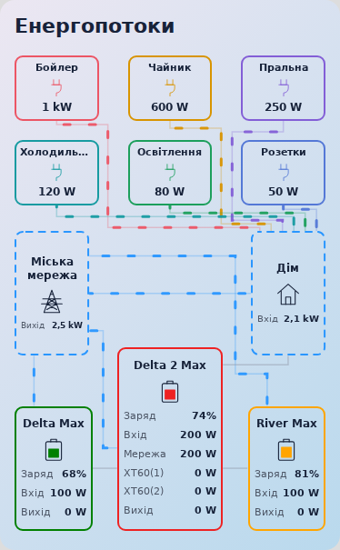
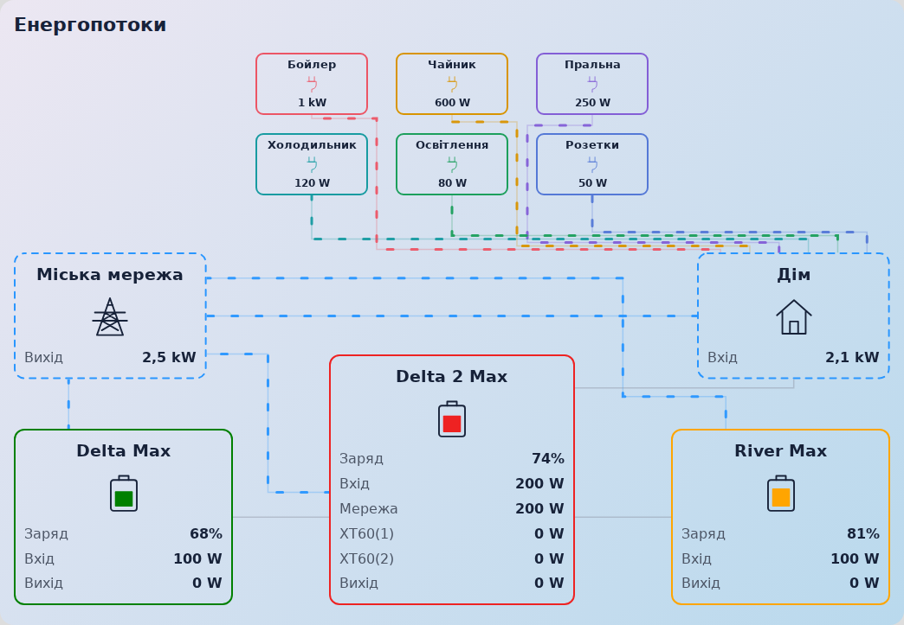

# Suris EcoFlow Flow Card 2.0.0-beta.1

[English guide](README_EN.md) · [Завантажити бету](https://github.com/Suris2009/suris-ecoflow-flow-card/releases/tag/v2.0.0-beta.1) · [Стабільна 0.1.12](https://github.com/Suris2009/suris-ecoflow-flow-card/releases/tag/v0.1.12)

**Попередній випуск:** макет і налаштування версії 2 ще доопрацьовуються. Для звичайних оновлень залишається стабільна 0.1.12.

Картка Home Assistant із візуальним редактором сутностей. Міська мережа ліворуч, дім праворуч, головна EcoFlow знизу між двома допоміжними станціями. Зверху — до шести активних індивідуальних споживачів із найбільшою потужністю, без гортання та збільшення висоти картки. Значення потужності містяться у квадратних блоках; на лініях лише рух потоку. Працює локально, без сторонніх бібліотек, CDN та збірки.

## Що потрібно перед встановленням

Це **картка панелі огляду**, а не інтеграція пристроїв. EcoFlow та лічильники мають уже надавати сутності в Home Assistant. Картка показує їхні значення; вона не вмикає станції, реле або прилади.

Для приладів потрібні датчики **потужності W / kW**, наприклад із розумних розеток. Датчик накопиченої енергії **kWh** не підходить. Налаштувати все можна у візуальному редакторі — YAML не обов’язковий.

## Що нового у версії 2

- До **20 налаштованих приладів**; на екрані одночасно **шість активних** у двох рядах по три.
- Якщо активних більше шести, прилад із більшою потужністю замінює найслабший. Решта зберігають свої місця. За однакової потужності вже показані мають пріоритет.
- У кожного приладу своя назва, іконка та колір. **Рамка й лінія від дому мають один колір цього приладу.**
- Допоміжні станції розташовано по боках головної. Маршрути залишаються горизонтальними та вертикальними.
- Налаштування станцій із версії 1 зберігаються. Споживачі додаються окремо; без них верхня частина порожня.



## Встановлення через HACS

1. Відкрий **HACS → ⋮ → Користувацькі репозиторії**.
2. Додай `https://github.com/Suris2009/suris-ecoflow-flow-card`, тип **Dashboard / Панель огляду** (у старих версіях — **Lovelace / Plugin**).
3. Знайди **Suris EcoFlow Flow Card** та завантаж **2.0.0-beta.1**. Якщо бета не пропонується, увімкни для цього репозиторію HACS-перемикач попередніх випусків. Такі сутності можуть бути вимкнені за замовчуванням: знайди сутність репозиторію у **Налаштування → Пристрої та служби → Сутності**, увімкни її й переведи перемикач у стан `on`. [Офіційне пояснення HACS](https://www.hacs.dev/docs/use/entities/switch/). Якщо бета недоступна через HACS, скористайся ручним встановленням нижче.
4. Онови сторінку Home Assistant. Якщо ресурс не додано автоматично, додай `/hacsfiles/suris-ecoflow-flow-card/suris-ecoflow-flow-card.js` як **JavaScript module** у ресурсах панелей огляду.
5. На панелі натисни **Редагувати → Додати картку → Suris EcoFlow Flow Card** і вибери сутності у візуальному редакторі.

Оновлення надходять через HACS і замінюють той самий JS-файл. Конфігурація сутностей зберігається у налаштуваннях картки на панелі. Якщо попередню версію вже було встановлено вручну, після переходу на HACS прибери її старий ресурс `/local/suris-ecoflow-flow-card.js` і старий JS-файл, щоб не завантажувати дві копії картки. Не видаляй саму налаштовану картку.

## Ручне встановлення через інтерфейс

1. Скопіюй `suris-ecoflow-flow-card.js` до папки `www` у каталозі конфігурації Home Assistant. Через Studio Code Server це зазвичай `/config/www`; в окремих версіях середовища каталог може відображатися як `/homeassistant/www`. Використовуй той каталог, у якому розташований `configuration.yaml`. Можна скористатися Samba або завантаженням файлу в редакторі. Якщо папку `www` щойно створено вперше, перезапусти Home Assistant.
2. Відкрий **Налаштування → Панелі огляду → ⋮ → Ресурси → Додати ресурс**. Якщо «Ресурси» не видно, увімкни розширений режим у профілі користувача.
3. URL: `/local/suris-ecoflow-flow-card.js?v=2.0.0-beta.1`. Тип: **JavaScript module**.
4. Онови сторінку Home Assistant. За потреби очисть кеш інтерфейсу в застосунку.
5. На панелі огляду натисни **Редагувати → Додати картку**, знайди **Suris EcoFlow Flow Card**.
6. Вибери сутності у візуальному редакторі. YAML не потрібен.

Репозиторій додається як користувацький у HACS; наявність у загальному каталозі HACS не передбачається.

## Додати індивідуальних споживачів

1. Відкрий редактор цієї картки й розділ **Індивідуальні споживачі**.
2. Натисни **Додати споживача**. Введи зрозумілу назву, наприклад «Бойлер».
3. Вибери його датчик потужності, наприклад `sensor.boiler_power`, та іконку в інтерфейсі Home Assistant.
4. Введи колір: `orange`, `red`, `green`, `#ff8800`, `rgb(255, 136, 0)` або `hsl(32, 100%, 50%)`. Лапки у візуальному полі не потрібні. Цей колір застосовується і до рамки, і до потоку **дім → прилад**.
5. Збережи картку. Повтори для інших приладів, максимум 20. Кнопка **Видалити** прибирає тільки налаштування приладу з картки.

Активним вважається прилад із потужністю **більшою** за поріг у розділі «Вигляд потоків»: типово понад **3 W**. Нульові, від’ємні, невідомі та недоступні значення не показуються. Поріг можна змінити. Покази менше 1000 W відображаються у W, від 1000 W — у kW. Довга назва скорочується в квадраті; повна доступна в підказці. Натискання на потужність відкриває докладну інформацію про сутність.

Список приладів **не віднімається від входу дому** і не підміняє його. Він розкладає частину загального споживання на окремі прилади; приховані та неналаштовані прилади також можуть споживати енергію. Рух кожної лінії залежить від потужності саме її приладу. Контур дому рухається за годинниковою стрілкою, коли він віддає енергію показаним споживачам.

### Приклад YAML для двох приладів

Це фрагмент налаштувань картки. Додай його до наявної конфігурації, зберігши розділи мережі та станцій. Замінюй сутності своїми.

```yaml
consumers:
  - id: boiler
    name: Бойлер
    power: sensor.boiler_power
    icon: mdi:water-boiler
    color: orange
  - id: fridge
    name: Холодильник
    power: sensor.fridge_power
    icon: mdi:fridge
    color: "#20b8c8"
```

`id` — сталий ідентифікатор приладу, а не сутність Home Assistant. У візуальному редакторі створюється автоматично. У YAML використовуй різні ідентифікатори з латинських літер, цифр, `_` і `-`; HEX-кольори бери в лапки.

## Перехід із версії 1 та повернення назад

Онови ресурс картки до бети, потім перезавантаж інтерфейс Home Assistant. Тип `custom:suris-ecoflow-flow-card` не змінюється; назви, сутності, кольори та швидкість станцій зберігаються. Не створюй нову картку і не додавай другий JS-ресурс. Після оновлення додай прилади через редактор.

Щоб повернутися до стабільної версії, збережи копію YAML картки й установи **0.1.12** через HACS або заміни той самий JS-файл стабільним. Перезавантаж інтерфейс. Версія 1 не відображає список споживачів; налаштування станцій сумісні.

## Налаштування сутностей

| Блок | Сутності |
| --- | --- |
| Міська мережа | Потужність, датчик наявності мережі та стан «мережа є» |
| Кожна допоміжна EcoFlow | Заряд, загальний вхід, загальний вихід; необов’язково потужність заряджання від мережі та окрема потужність передачі на головну станцію |
| Головна EcoFlow | Заряд, загальний вхід, загальний вихід, окремий AC-вхід від мережі, два окремі DC-входи XT60(1) і XT60(2); необов’язково окремий вихід на дім |
| Дім | Необов’язковий датчик вхідної потужності |

Джерел живлення дому лише два: міська мережа та головна EcoFlow. Якщо мережа є, дім живиться від мережі. Якщо мережі немає, дім живиться від головної станції. Окрема сутність перемикача дому не потрібна.

У блоці міської мережі вибери датчик її наявності й стан «мережа є» (`on` за замовчуванням). Для двійкового датчика протилежний стан означає відсутність мережі. Якщо стан «мережа є» — `off`, стан `on` означає відсутність мережі. Недоступний, невідомий або не розпізнаний стан зупиняє обидві лінії живлення дому. Нульове споживання не означає відсутність мережі. Старі поля `home.source_entity`, `home.grid_state` та `home.main_state` ігноруються.

Назви всіх п’яти блоків змінюються в редакторі. Мови редактора: українська та англійська. Окремі кольори мережі, кожної допоміжної та головної EcoFlow, поріг активної потужності та базовий час руху штрихів також задаються через інтерфейс.

## Якщо окремого датчика споживання дому немає

Залиш поле **Вхід дому (необов’язково)** порожнім. Вибери датчик загальної потужності міської мережі, входи двох допоміжних станцій, окремий AC-вхід головної станції та датчик наявності міської мережі.

- Дім від міської мережі: **розрахунковий вхід дому = загальна потужність мережі − заряджання EcoFlow №2 − заряджання EcoFlow №3 − AC-вхід головної EcoFlow**.
- Дім від головної EcoFlow: використовується окремий вихід на дім, якщо його вибрано, або загальний вихід головної станції.
- Наприклад: мережа 1000 Вт, входи станцій 100, 200 і 300 Вт → вхід дому 400 Вт.

Для розрахунку від мережі потрібна доступна загальна потужність міської мережі. Не вибрані, відсутні або недоступні входи станцій вважаються нулем лише в розрахунку дому. Коли EcoFlow вимкнені, дім споживає всю потужність мережі. Коли станції заряджаються, їхні доступні додатні входи віднімаються. На самих блоках недоступні показники залишаються —. Якщо станція заряджається, але її телеметрія недоступна, оцінка дому може бути завищена. Від’ємний залишок при різночасових оновленнях показників обмежується нулем. Вхід дому від мережі залишається розрахунковим: датчики станцій і лічильник мережі можуть оновлюватися в різний час і вимірювати потужність на різних ділянках.

Якщо вибраний датчик споживання дому доступний, використовується його значення. Якщо він недоступний, показується —. Для автоматичного розрахунку потрібно саме очистити це поле. Джерело дому автоматично визначається за датчиком наявності міської мережі.

## Логіка потоків

| Лінія | Умова руху |
| --- | --- |
| Мережа → допоміжна EcoFlow | Окрема потужність заряджання від мережі перевищує поріг; якщо її не задано, використовується загальний вхід цієї станції |
| Мережа → головна EcoFlow | Окрема потужність AC-входу перевищує поріг |
| Допоміжна EcoFlow → головна | Окрема потужність передачі перевищує поріг; якщо її не задано, використовується загальний вихід допоміжної станції. |
| Мережа → дім | Джерело дому — мережа і споживання перевищує поріг |
| Головна EcoFlow → дім | Джерело дому — головна станція і споживання перевищує поріг. Якщо датчик споживання не вибрано, для анімації використовується вихід головної станції на дім або її загальний вихід |

Усі потоки від мережі потребують заданого стану «мережа є». Якщо датчик не вибрано або він недоступний, джерело дому невідоме й потоки від мережі неактивні.

Головна EcoFlow показує **XT60(1)** та **XT60(2)** окремо. Вибери сутність для кожного порту в її розділі редактора. Ці порти не прив’язуються до EcoFlow №2 чи №3 й не керують анімацією передачі між станціями. Допоміжні станції працюють по черзі: лінія активна за власною вихідною потужністю.

Вхід головної станції можна не вибирати: тоді картка додає вибрані AC-вхід, XT60(1) і XT60(2), **лише якщо всі вибрані показники доступні**. Не вибраний порт не додається. Якщо вибрано датчик загального входу, використовується його значення. Старий датчик сонячного входу зберігається в полі «XT60(1)»; якщо раніше це був сумарний датчик, заміни його окремим датчиком першого порту. Загальний вхід ніколи не підміняє AC-вхід. Загальне споживання міської мережі не обчислюється з виходів станцій: для нього потрібен власний датчик. За відсутності окремого датчика дому цей загальний показник використовується для розрахунку залишку після заряджання станцій.

Поріг за замовчуванням — 3 Вт. Швидкість кожної лінії автоматично залежить від її власної потужності: більше ватів — швидший рух. Для дому використовується саме показаний вхід дому, а не загальна потужність міської мережі; для передачі між станціями — їхній окремий вихід або вибраний вихід передачі, а не XT60 головної. Однакова потужність дає однакову швидкість незалежно від довжини маршруту. Швидкість зростає плавно й має верхню межу. Поле «Базовий час руху (с)» зберігає старе налаштування `appearance.duration`: типово 3 с на 100 пікселів за 100 Вт; більше значення уповільнює всі потоки. Оновлення показників змінює швидкість без перезапуску анімації. Неактивні або недоступні потоки не рухаються. За системного налаштування зменшення руху активні лінії показуються статично. Значення рівно на порозі не активує лінію. Картка підтримує потужності у W, kW, mW, MW, Вт, кВт і відображає їх у ватах. Датчики енергії Wh/kWh не підходять. Значення без одиниці трактуються як вати. SOC береться у відсотках.

Якщо до допоміжної станції підключені інші навантаження, вибери окремий DC-вихід для передачі на головну. Загальний вихід у такому разі не показує лише цей потік. Сонячні входи головної станції відображаються незалежно від допоміжних станцій.

Відсутні, недоступні або нечислові показники показуються як `—`, реальний нуль — як `0 W`. Натискання на показник відкриває докладну інформацію про його сутність. Картка не керує реле та виходами EcoFlow.

## Кольори рамок і потоків

У розділі **Вигляд потоків** задаються чотири окремі CSS-кольори: мережа, EcoFlow №2, EcoFlow №3, головна EcoFlow. Кожен колір застосовується до рамки відповідного блоку, значка батареї та всіх його вихідних потоків. Наприклад, `#ff8800` для EcoFlow №3 робить оранжевими її рамку і потік до головної станції. Потоки мережі до станцій і дому мають колір мережі. Рамка дому має колір активного джерела; за невідомого джерела вона нейтральна. Попередній спільний колір передачі збережеться для обох допоміжних станцій до вибору окремих кольорів. Підтримуються англійські назви (`red`, `green`, `orange`), HEX (`#f00`, `#ff0000`, зокрема з прозорістю), `rgb()`/`rgba()` та `hsl()`/`hsla()`. У візуальному полі вводь колір без лапок. Порожнє поле повертає типовий колір.

Поля у візуальному редакторі можна очищати й заповнювати заново: фокус і відкриті розділи зберігаються. Недописаний колір або некоректне число залишаються в полі; останній коректний попередній перегляд зберігається, доки введення не завершено. Порожні назви та числові поля використовують типові значення під час показу картки.

## Вигляд та перевірка

Усі лінії складаються лише з горизонтальних і вертикальних відрізків із прямими кутами. Міська мережа має окрему лінію до кожної станції та дому. Від допоміжних EcoFlow до головної проходять прямі горизонтальні лінії. Лінії від дому до споживачів прокладено окремими маршрутами між їхніми квадратами. Від головної станції до дому лінія повертає лише один раз і входить у дім знизу. Короткі рухомі штрихи без стрілок повторюють ці самі маршрути від джерела до споживача.

Значки батарей усіх трьох станцій показують рівень заповнення за їхніми датчиками заряду. 0% — порожня батарея, 100% — повна. Якщо заряд невідомий, недоступний або поза діапазоном 0–100%, усередині батареї відображається прочерк. Колір заповнення відповідає кольору станції. У домі потужність підписана «Вхід» і показується без знака приблизного значення. Рядок із назвою джерела прибрано: активне джерело видно за потоком і кольором рамки. У всіх блоках значення від 1000 W показуються у kW із точністю до двох десяткових знаків; менші — у W. Підписи, числа та одиниці всіх показників залишаються в одному рядку. Блок мережі має ту саму ширину, що й дім. Розмір тексту рядка зменшується лише за потреби, щоб повністю вмістити підпис, число та одиницю.

Фон квадратних блоків майже прозорий і має лише легкий відтінок кольору теми картки. Градієнтний фон картки видно крізь блоки.

Картка підлаштовується під світлу або темну тему Home Assistant. На вузькому екрані блоки компактніші й можуть ставати вищими для читабельності показників. Для збереження просторого вигляду макета використовуй широку секцію панелі. Налаштування розміру в редакторі панелі можуть збільшити ширину картки.

`demo.html` — автономний приклад із сімома налаштованими приладами, режимами заміни найслабшого та вимкнення приладів. Показники вигадані. Його можна відкрити у браузері поруч із JS-файлом, щоб перевірити перемикання режимів. Демонстрація не підключається до твоєї системи.

Перевірка пакета: синтаксис JS та браузерні сценарії з тестовими станами Home Assistant. Візуальний редактор тестується на контракті `ha-form`; остаточна перевірка реальних селекторів потребує встановлення у Home Assistant. Підключення до твоєї системи й вибір реальних сутностей ще не виконані.

Вимоги HACS: https://hacs.dev/docs/publish/plugin/

API карток і встановлення ресурсу: https://developers.home-assistant.io/docs/frontend/custom-ui/custom-card/





## Тести для розробників

Для роботи самої картки Node.js не потрібен. Для повторення тестів: `npm install`, `npx playwright install chromium`, `npm test`. Якщо Chromium вже встановлено, можна передати шлях через `SURIS_CHROMIUM_PATH`. Скриншоти `preview-desktop.png` і `preview-mobile.png` створені з реальної картки на тестових показниках.

У всіх блоках одиниці потужності — **W** та **kW**. Від 1000 W значення показуються в kW. Підпис, число та одиниця залишаються в одному рядку; шрифт зменшується лише коли рядку бракує місця. Рядки вміщуються без розширення блоків під конкретне число.

Рамка блока, який віддає енергію хоча б за однією активною вихідною лінією, стає пунктирною й рухається **за годинниковою стрілкою**. Колір рамки зберігається. Швидкість залежить від сумарної потужності його активних вихідних потоків. Коли передача припиняється, повертається суцільна нерухома рамка. Дім також віддає енергію показаним споживачам, тому за їхньої активності його рамка рухається; без активних споживачів залишається суцільною. За системного налаштування зменшення руху пунктирні рамки не рухаються.
