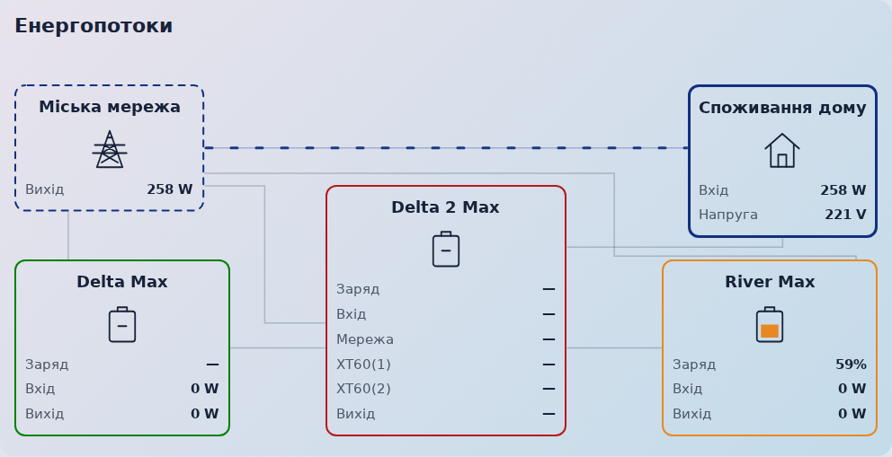
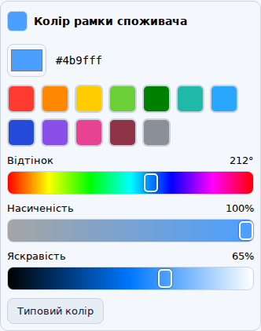

# Suris EcoFlow Flow Card 2.0.5-beta.1

[Українська інструкція](README.md) · [Download 2.0.5-beta.1](https://github.com/Suris2009/suris-ecoflow-flow-card/releases/tag/v2.0.5-beta.1) · [Previous 0.1.12](https://github.com/Suris2009/suris-ecoflow-flow-card/releases/tag/v0.1.12)

**Beta 2.0.5-beta.1 for testing flows with unavailable stations.** Upgrading from version 1 or a version 2 beta preserves the card configuration.

A Home Assistant dashboard card with a visual entity editor. City grid is on the left, home on the right, and the main EcoFlow sits between the two auxiliary stations at the bottom. Up to six active home consumers appear above them, without scrolling. The card automatically shrinks when one or both consumer rows are unused. Power readings stay inside the blocks; lines show only moving flow.

In HACS open the card → ⋮ → Redownload, enable beta versions and choose **2.0.5-beta.1**. Reload the frontend after installation. Release 2.0.4 has been withdrawn from stable releases because it hid the grid-to-home flow when the main EcoFlow was unavailable.



This is a **dashboard card**, not a device integration. Install your EcoFlow and meter integrations first so their entities are available in Home Assistant. The card displays readings; it does not switch relays, outputs or appliances. It runs locally without external libraries, CDN or a build step.


## Automatic height

Height follows **visible active consumers**, not the number of configured entities:

| Visible active devices | Rows | Height compared with the full layout |
| --- | --- | --- |
| 4–6 | 2 | Full height |
| 1–3 | 1 | 93 px shorter |
| 0 | 0 | 186 px shorter |

As devices switch on or off, the card resizes automatically. A single row moves up, followed by the grid, home and stations. Block sizes are retained and all flows remain orthogonal. A dashboard section with a forced fixed height can retain empty space outside the card.

[One-row example](preview-one-row.png) · [No active devices](preview-no-consumers.png)

## Install with HACS

1. Open **HACS → ⋮ → Custom repositories**.
2. Add `https://github.com/Suris2009/suris-ecoflow-flow-card`, category **Dashboard** (Lovelace / Plugin in older versions).
3. Download **2.0.5-beta.1**. If the card is already installed, open its HACS entry and install the available update.
4. Reload the Home Assistant frontend. If HACS did not add the resource, add `/hacsfiles/suris-ecoflow-flow-card/suris-ecoflow-flow-card.js` as a **JavaScript module** in dashboard resources.
5. Open **Edit dashboard → Add card → Suris EcoFlow Flow Card**. Choose your entities in the visual editor. YAML is optional.

This repository is added as a custom HACS repository; inclusion in the default catalog is not assumed. Keep only one resource for this card. When moving from a manual installation, remove its old `/local/` resource after adding the HACS resource; keep your configured dashboard card.

## Manual installation

1. Download `suris-ecoflow-flow-card.js` from the 2.0.5-beta.1 release. Put it in the `www` folder beside your Home Assistant `configuration.yaml`, commonly `/config/www`. If you just created `www` for the first time, restart Home Assistant.
2. Open **Settings → Dashboards → ⋮ → Resources → Add resource**. Enable Advanced mode in your user profile if Resources is hidden.
3. URL: `/local/suris-ecoflow-flow-card.js?v=2.0.5-beta.1`; type: **JavaScript module**.
4. Reload the frontend, then add and configure the card through the visual editor. Clear the frontend cache if the old version remains visible.

## Configure the stations and home

| Block | Entities to select |
| --- | --- |
| City grid | Total power, optional availability entity and its available state (`on` by default) |
| Each auxiliary EcoFlow | Charge %, total input, total output; optionally separate grid charging and transfer-to-main power |
| Main EcoFlow | Charge %, total input, total output, separate AC grid input, independent XT60(1) and XT60(2) DC inputs; optionally a dedicated home output |
| Home | Optional input power sensor; leave empty for automatic calculation. Optional voltage sensor |

To show the house voltage, select **Home voltage (optional)** in the **Home** section of the visual editor. The **Voltage** row appears below **Input**, in V. Without a selected sensor the row stays hidden; an unavailable reading shows `—`. Voltage is read from that sensor, not inferred from the grid or battery. In YAML, set `home.voltage: sensor.home_voltage`.

The home source is automatically selected from main EcoFlow output, independently of the grid status sensor. Output power above the flow threshold selects main EcoFlow; a valid non-negative reading at or below the threshold selects grid. Select the dedicated **Output power to home** in Main EcoFlow when other loads use the station; otherwise its total output is used. When station output is unavailable, invalid or negative, grid power above the threshold selects grid. With no usable power data from either source, the home source remains unknown. This is an inference from output power, not a measurement of the transfer switch.

Existing configurations automatically use main EcoFlow output after updating; no manual mode change is needed. Legacy `home.source_mode`, `home.source_entity`, `home.grid_state` and `home.main_state` fields are ignored. The source-mode selector has been removed.

The optional **Grid availability** sensor only controls the indicator inside the city grid block. When it reports an outage, a red **No grid** label pulses in place of the tower icon. The name and power reading remain visible. It disappears when grid power returns, the sensor is cleared or its state is unknown. With reduced motion the label stays steady. No state of this sensor affects any flow. Station charging and transfers use their own power readings.

Without a home sensor, the card calculates **home grid input = total grid power − auxiliary 1 grid charging − auxiliary 2 grid charging − main AC input**, bounded at zero. Auxiliary charging uses its dedicated charging sensor when selected, otherwise total input. Missing or unavailable charging readings count as zero in this calculation, so an offline station that is actually charging can overestimate home input. When the stations are off, home receives the entire grid reading. Example: grid 1000 W minus station charging of 100, 200 and 300 W gives home 400 W. The meters may update at different times, so this is a calculated reading.

When supplied by the main station, home uses the selected dedicated home output or otherwise the main total output. A selected home input sensor overrides either calculation; if that sensor becomes unavailable, the card shows `—`. Clear the field to restore automatic calculation.

Main station rows:

| Row | Meaning |
| --- | --- |
| Charge | Battery state of charge in %; also controls battery icon fill |
| Input | Total input sensor, or sum of selected AC and XT60 sensors when all selected readings are available |
| Grid | Separate AC input power; total input never substitutes for AC input |
| XT60(1) | First DC input port |
| XT60(2) | Second DC input port |
| Output | Total station output |

XT60 ports are independent of the auxiliary stations. Their readings do not decide auxiliary transfer flow. Each auxiliary transfer uses its dedicated transfer entity or otherwise total output. If other loads use that station, select a separate DC transfer sensor. The older first solar input field maps to XT60(1); replace an old combined solar sensor with the actual first-port sensor where needed.

## Add up to 20 individual consumers

1. Open the card editor and **Individual consumers**.
2. Click **Add consumer**, give it a name, select its **power** sensor and choose an icon with the Home Assistant icon picker.
3. Open **Consumer border color** and choose a preset swatch or mix hue, saturation and brightness with the sliders. Tap the large color field for your device’s native color picker. The preview and HEX update immediately. You can also type a color: `red`, `green`, `orange`, `#ff8800`, `rgb(255, 136, 0)` or `hsl(32, 100%, 50%)`. Do not add quotes in the visual field. **This color applies to the device's border. Shared row lines and their branches use the home color, following its active source.**
4. Save the card. Repeat for up to 20 devices. Remove deletes only the entry from this card, not the Home Assistant entity.

Use power sensors in **W / kW**, for example from smart plugs, rather than accumulated energy sensors in **kWh**. The six highest-power active devices appear in two rows of three. Activity means power strictly above the flow threshold, **3 W by default**. Zero, negative, unknown and unavailable readings are hidden. Change the threshold in Flow appearance if needed.

A stronger device replaces the weakest visible one. Other visible tiles keep their slots; ties favor devices already displayed. No paging or scrolling is needed. Long names are shortened inside tiles, with full names in tooltips. Click a power reading for the entity's more-info dialog.

Consumer readings **do not subtract from home input or replace it**. They explain part of the household total; hidden and unconfigured loads can also draw power. The lower row fills first from left to right, followed by the upper row. When devices become inactive, lower-row gaps are filled from above. Each row has one shared home feeder with short vertical branches. Feeder speed follows the total power of visible devices in that row; each branch follows its device power. Both feeders and all branches use the home color. The home outline always remains solid and stationary.

Optional YAML fragment to append to an existing card configuration, keeping the grid and station sections:

```yaml
consumers:
  - id: boiler
    name: Boiler
    power: sensor.boiler_power
    icon: mdi:water-boiler
    color: orange
  - id: fridge
    name: Fridge
    power: sensor.fridge_power
    icon: mdi:fridge
    color: "#20b8c8"
```

Replace the example entities. `id` is a stable card identifier, not a Home Assistant entity. The editor creates it automatically. In YAML, use unique Latin letters, digits, `_` and `-`; quote HEX colors.

## Colors, readings and animations

Open a color under **Flow appearance** to choose a preset or mix **Hue / Saturation / Brightness** with sliders. The large color field opens the phone or computer’s native picker. The preview and HEX update immediately; **Default color** restores the original. Every consumer has the same visual controls. Alpha transparency remains available through typed HEX or `rgba()`; visual mixing selects an opaque color.



Set separate source colors for grid, each auxiliary station and main station in **Flow appearance**. Each color applies to its station border, battery fill and outgoing lines. Home uses its active source's color, or a neutral border when the source is unknown. Individual consumers have their own border colors; their flow lines use the home color. Empty color fields restore defaults. Incomplete color text stays editable while the last valid preview remains displayed.

All lines have right-angle routes; no diagonals. Supplying grid and station blocks have clockwise moving dashed outlines, while inactive outlines are solid. The home outline always remains solid and stationary. More watts makes movement faster, with a bounded speed. Increasing Base movement time slows all lines. Live power changes adjust animation speed without restarting it. System reduced-motion settings make active flows static.

All power rows stay on one line. Values below 1000 W use W; values from 1000 W use kW with up to two decimal places. Supported input units include W, kW, mW, MW, Вт and кВт; a reading without a unit is treated as W. Wh / kWh are not power. Missing readings show `—`; real zero shows `0 W`. Station battery icons fill from valid 0–100% readings. The blocks have nearly transparent backgrounds and follow the Home Assistant theme.

## Upgrade from version 1 or a beta, or roll back

Update the same resource to **2.0.5-beta.1** and reload the frontend. The card type remains `custom:suris-ecoflow-flow-card`. Existing station entities, names, colors and flow settings are retained. When upgrading from version 1, add consumers in the editor; none are added automatically. Existing consumer settings from version 2 betas are retained. Without active consumers, the card shrinks automatically. Do not add a duplicate resource or recreate the card.

To roll back, save a copy of the card YAML, install **0.1.12** through HACS or replace the same JS file with the version 1 asset, and reload the frontend. Version 1 does not display consumers; station settings remain compatible.

## If something is missing

| Symptom | Check |
| --- | --- |
| Consumer not visible | Power sensor selected, available reading above the threshold, and within the six strongest |
| Wrong consumer color | Enter a valid CSS color without quotes in the visual editor; use quotes for HEX in YAML |
| No grid or home supply line | Check the main home output sensor and corresponding power readings; the grid availability sensor only controls the warning |
| Home differs from meter | Home excludes station charging; unavailable charging sensors count as zero; meter updates may differ in time |
| Main Input shows `—` | Select total input, or make every selected individual input sensor available |
| Old layout after upgrade | One resource only, correct downloaded version, frontend reloaded / cache cleared |

## Demo and development

Open `demo.html` beside the JS file for fictional readings, seven configured consumers, strongest-six replacement, a single row and automatic shrinking when consumers are inactive. See [desktop preview](preview-desktop.png). This demo does not connect to your devices.

Run `npm install`, `npm test` and `node scripts/validate-release.cjs`. Browser tests use Playwright; `SURIS_CHROMIUM_PATH` can point to an installed Chromium. Tests cover power/source logic, consumer ranking, limits, editor draft typing, visual color mixing and reset, automatic zero/one/two-row height changes, animation continuity, reduced motion and layout/route geometry at 320–1150 px. [Release instructions](RELEASING.md).
